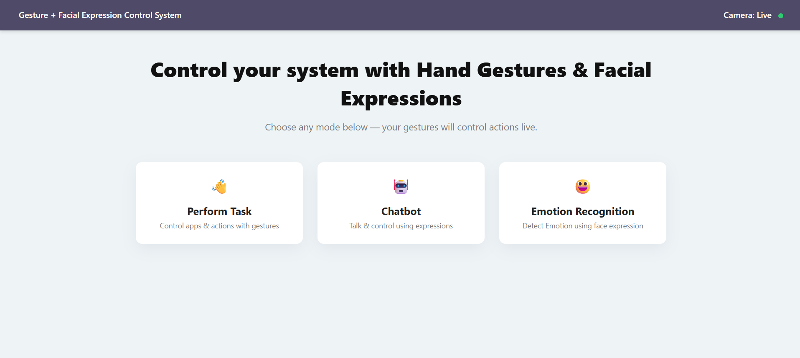
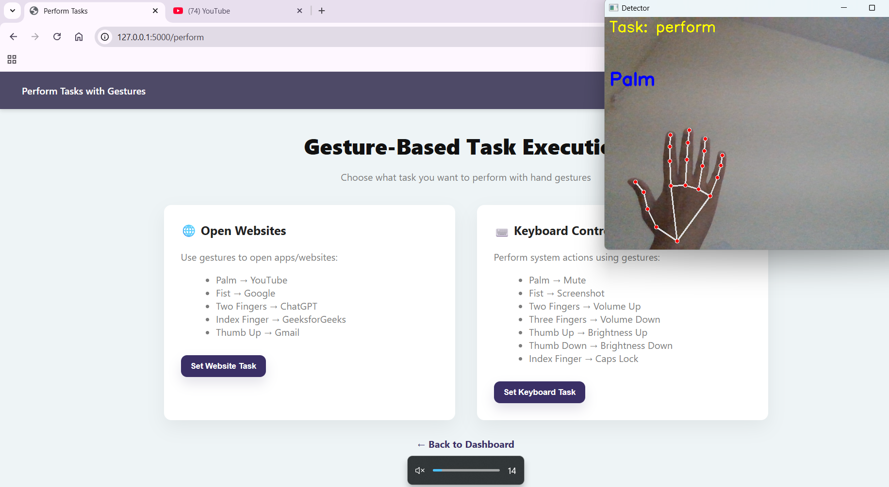
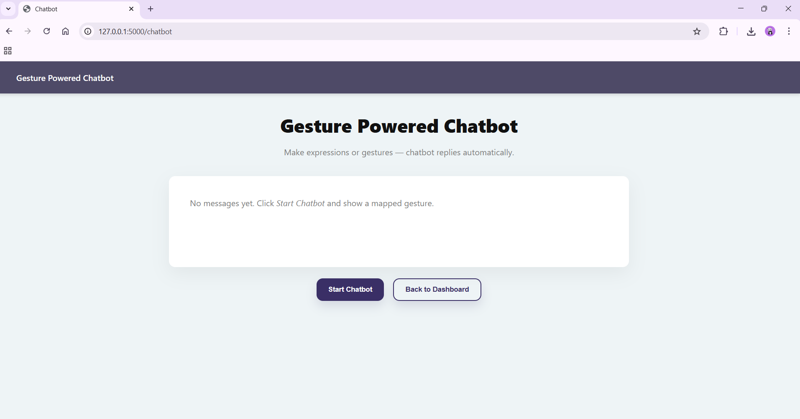

🚀 GesturaAI
Intelligent Gesture & Facial Expression Control System

GesturaAI is a real-time AI-powered system that enables users to control applications, system functions, and chatbot interactions using hand gestures and facial expressions.

This project combines Computer Vision and Web Development to create a touchless human–computer interaction system.

📌 Features

✋ Real-time hand gesture detection

😀 Facial expression recognition using Face Mesh

🌐 Open websites using mapped gestures

⌨ Perform system controls (volume, brightness, screenshot, caps lock)

🤖 Gesture-powered chatbot interaction

📷 Live camera-based action execution

🖥 Flask-based interactive web dashboard

🛠 Tech Stack

Backend:

Python

Flask

OpenCV

MediaPipe (Hands & Face Mesh)

NumPy

PyAutoGUI

Requests

Frontend:

HTML

CSS

JavaScript

🧠 How It Works

MediaPipe detects hand landmarks and facial mesh points in real time.

Gesture patterns are mapped to predefined actions.

Flask handles backend logic and serves the web interface.

Detected gestures trigger system commands or chatbot responses instantly.

📂 Project Structure
GesturaAI/
│
├── app.py
├── gesture_detector.py
├── requirements.txt
├── README.md
│
├── templates/
│   ├── index.html
│   ├── perform.html
│   ├── chatbot.html
│
├── static/
│   ├── css/
│   ├── js/
│   ├── images/
│
└── .gitignore

⚙ Installation & Setup
1️⃣ Clone the repository
git clone https://github.com/your-username/GesturaAI.git
cd GesturaAI

2️⃣ Create virtual environment
python -m venv venv38

Activate it:

venv38\Scripts\activate

3️⃣ Install dependencies
pip install -r requirements.txt

4️⃣ Run the application
python app.py

Open your browser and go to:

http://127.0.0.1:5000/

🎯 Use Cases

Touchless system control

AI-based human–computer interaction research

Accessibility support systems

Computer vision learning project

## 📸 Project Screenshots

### 🏠 Dashboard

### ✋ Gesture Detection

### 🤖 Chatbot Interface

👩‍💻 Author

Manna Kumari
B.Tech CSE (Data Science)
Passionate about AI, Computer Vision & Intelligent Systems
